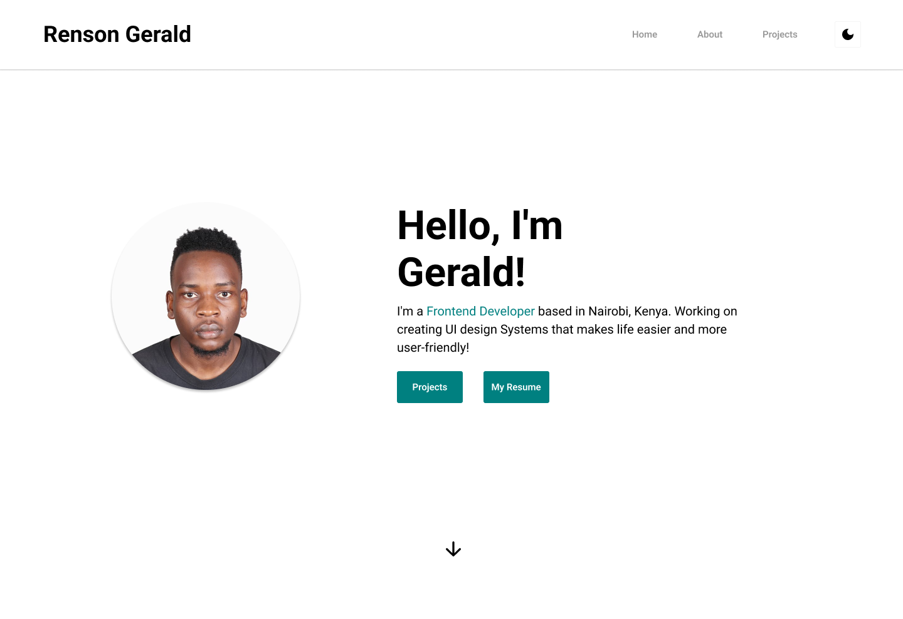

My Portfolio

This is a portfolio created with Tailwind CSS and Next.js.



## You can View my design here

You can access the design file at
`https://www.figma.com/file/fuNTgt1ps4TMhlQHpTFufD/My-Portfolio?node-id=0%3A1&t=38rPgphFZuWnd7a1-1`

The prototype at
`https://www.figma.com/proto/fuNTgt1ps4TMhlQHpTFufD/My-Portfolio?node-id=0-1&viewport=893%2C793%2C0.47&scaling=min-zoom&starting-point-node-id=2%3A2`

## Running Locally

Can run the application in VS Code or a terminal and it will be available at `http://localhost:3000`.

## Deployed App

You can view the application at
`https://renson-gerald.vercel.app/`

```bash
npm install
npm run dev
```
